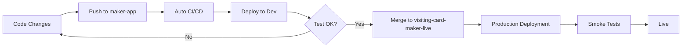

# Branch Setup Summary

## ✅ Branches Created and Configured

### 1. **maker-app** (Development)
- **Purpose**: Development and testing
- **Auto-deploy**: ✅ Enabled
- **URL**: `https://maker-app.[amplify-domain]`
- **Amplify Stage**: DEVELOPMENT
- **Workflow**: `maker-app-ci.yml`, `maker-app-deploy.yml`

### 2. **visiting-card-maker-live** (Production)
- **Purpose**: Production environment
- **Auto-deploy**: ✅ Enabled (with confirmation)
- **URL**: `https://visiting-card-maker-live.[amplify-domain]`
- **Custom Domain**: `https://app.yourdomain.com` (configurable)
- **Amplify Stage**: PRODUCTION
- **Workflow**: `maker-app-deploy-production.yml`
- **Protection**: Requires manual confirmation

## Terraform Configuration

The infrastructure now supports both branches:

```hcl
# Development Branch
resource "aws_amplify_branch" "main" {
  branch_name = "maker-app"
  stage       = "DEVELOPMENT"
}

# Production Branch
resource "aws_amplify_branch" "production" {
  branch_name = "visiting-card-maker-live"
  stage       = "PRODUCTION"
}
```

## Deployment Workflow

### Development → Production Flow



## Quick Commands

### Deploy to Development
```bash
git checkout maker-app
git add .
git commit -m "Your changes"
git push origin maker-app
```

### Deploy to Production
```bash
# Option 1: Merge from dev
git checkout visiting-card-maker-live
git merge maker-app
git push origin visiting-card-maker-live

# Option 2: GitHub Actions UI
# Go to Actions → "Maker App - Deploy to Production" → Run workflow
```

## Setup Infrastructure

### Run Setup Script
```bash
cd infrastructure/maker-app
./setup.sh  # Creates both branches in Amplify
```

### Manual Terraform Apply
```bash
cd infrastructure/maker-app
terraform init
terraform apply
```

## Environment Variables

### Development
```bash
VITE_APP_NAME=Visiting Card Maker
NODE_ENV=development
ENV=development
```

### Production
```bash
VITE_APP_NAME=Visiting Card Maker
NODE_ENV=production
ENV=production
```

## GitHub Secrets Required

Both branches need:
- `AWS_ACCESS_KEY_ID`
- `AWS_SECRET_ACCESS_KEY`
- `AWS_REGION`
- `AMPLIFY_WEBHOOK_URL` (for dev)
- `AMPLIFY_PRODUCTION_WEBHOOK_URL` (for prod)
- `AMPLIFY_DEFAULT_DOMAIN`

## URLs After Deployment

Get URLs from Terraform:
```bash
terraform output main_branch_url          # Development
terraform output production_branch_url     # Production
terraform output application_url           # Custom domain
```

## Monitoring

### Development
- GitHub Actions: https://github.com/roosterslab/monoatomlabs/actions
- AWS Console: Check Amplify app → maker-app branch

### Production
- GitHub Actions: https://github.com/roosterslab/monoatomlabs/actions
- AWS Console: Check Amplify app → visiting-card-maker-live branch

## Custom Domain Configuration

To add custom domains:

```hcl
# terraform.tfvars
domain_name = "yourdomain.com"
domain_prefix = ""                          # Root domain
production_domain_prefix = "app"            # app.yourdomain.com
```

Results in:
- Development: `https://dev.yourdomain.com`
- Production: `https://app.yourdomain.com`
- Main: `https://yourdomain.com`

## Branch Protection (Recommended)

Set up in GitHub:
1. Go to Settings → Branches
2. Add rule for `visiting-card-maker-live`
3. Enable:
   - Require pull request reviews
   - Require status checks to pass
   - Require branches to be up to date

## Cost Estimate

AWS Amplify pricing:
- **Build minutes**: $0.01/minute
- **Data storage**: $0.15/GB
- **Data transfer**: $0.15/GB

Estimated monthly cost:
- Development: $5-10
- Production: $10-20
- **Total**: ~$15-30/month

## Support

- Infrastructure: `infrastructure/maker-app/README.md`
- Deployment: `infrastructure/maker-app/DEPLOYMENT.md`
- Quick Start: `infrastructure/maker-app/QUICK_START.md`
